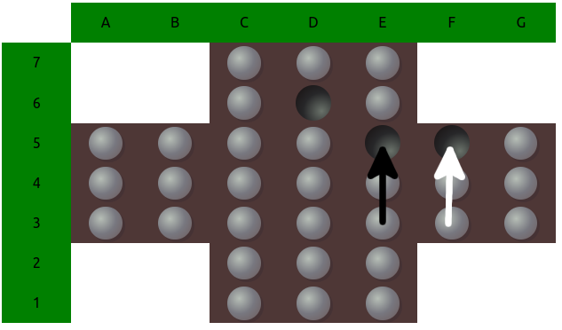

I recently lauchend [https://www.pegsolitairetrainer.com](https://www.pegsolitairetrainer.com), a website to play and train peg solitaire. In order to to this, I solved the game completely. In the following article I'm going to tell you exactly how I solved this game.

You might think now: this looks like a simple game, what is all this heck about? Let's take a look at the maths real quick. In the classical board there are 33 positions, which can have a hole or a peg. So we end up with 
    
possible positions. For the sake of simplicity if we just need 3 bytes to store all relevant information for one positions, we would need 24 GB to 
store all the information to solve game. The game looks simple but don't led this fool you, it's HUGE.

### Pegsolitaire Rules
Before we dive into it, here's a quick reminder of the rules. One always has to jump above one adjacent peg (one of the grey dots) into a hole (black). The allowed direction of jumps are left, right, up and down. Once a jump is completed the jumped over peg is removed. So after each jump, the number of pegs is decreased by one. The goal is to remain with only one peg which is at the center of the board.


### Brute Forcing Pegsolitaire - General Idea
The idea is generating a value for each position. This value is a measure of the quality of the position. The value is determined by the number of pegs which one can remove if perfect play is assumed. This can add up to 31 (33 peg positions, starting position has 32 pegs, subtract the one peg that remains in the end). We add an arbitrary positive bonus if the last peg remains in the center. This results in 41 points for perfect play. Note that there are quite a lot of ways to finish the game, e.g. after 10 jumps (21 pegs remaining) there are 89923 board positions possible of which 35854 can still be finished with one peg in central position.

In order to reach a better position, one checks all the values of the positions that can be reached by a valid move. The best strategy is then just choosing the move which results in the position with the highest value. 

The difficult part is usually to calculate all these values for each and every position, since the space of possible positions is large and memory and computation time are finite. So for some really large games (like chess and go) one has to use approximation values which generalize over multiple positions.
But fortunately for us, pegsolitaire can be handled quite well and solved considerably fast (<10 min) on modern hardware with the an efficient implementation of the self-written solver.
$\alpha$
    h<sub>&theta;</sub>(x) = &theta;<sub>o</sub> x + &theta;<sub>1</sub>x
    

 


### Transposition Tables
Brute force solving a game usually means to walk through all the paths that the allowed moves take us and remember which of these lead to which result (or simplified: just at which we end up winning). But paths can cross and even on different paths we can end up at the same position. Since for the game it does not matter how we reached the position (we are not rewarded for taking path A compared to path B), we can just calculate a value for each position and totally forget about the paths in this regard. We just use paths to systematically collect the values for all possible positions. When we reach a position for which we already know the value, there is no need to walk along this path further and we can restart the game and explore other paths.

Let's look at this in detail. We end up in the same position whether we perform the jump indicated by the black arrow first (let's call this position `varA`) and then follow the white arrow (let's call that position `TranspositionEnd`) or the other way round (`varB`, then `TranspositionEnd`). 
Let's say we brute force the game and take the route `varA` then jump to `TranspositionEnd` and calculate all possible variations from there on and find, that both positions are still winnable, thus giving both the value 41. Now we take the next iteration and find ourselves at `varB`, then jump to `TranspositionEnd`. 
A naive algorithm would just continue from here on and calculate all possible moves to find out that both are again winnable, but we have already done the work. With transposition tables we jump from `varB` to `TranspositionEnd`, check if we find this position in the table, and yes, indeed, we'll find it, return the value 41 and save this value for `varB` aswell. Done, no more iteration needed for this branch.

### Exploiting Symmetries
There is one more thing we can exploit to save quite a lot of iterations. You might have realized that the whole board is totally symmetrical (note that winning means resulting in a symmetrical position). We can rotate the board at 90-degree angles or mirror it along the middle on a horizontal or vertical axis and still result in positions that are equivalently good. But how can we exploit this? Sure, for each position there is, we could calculate all symmetric positions and check if we already have that in the transposition table. But that is actually quite cumbersome and impractical if you e.g. want to look up the value of a specific position. So I did it differently by implementing a symmetry invariant hash, meaning that all 8 positions that are symmetric to each other are hashed and this hash is exactly the same for these (and only these) positions. But what are invariant operations under rotation and mirroring?
First let's only take into account a rotation and denote a rotation matrix by
    
since rotation matrices are symmetric:
    
If we rotate a vector 
    
the length of this vector is unchanged
    </br>
Note that this property holds for any metric. Therefore I calculated the sum of the euclidian, minkowski, cosine and hamming distances between the holes and concatenated the results to a string. Further, the distances also don't change for mirroring, I'll save you the math here, since it works in the same fashion as above. This is not complete yet, but so far the hash looks like this: </br>
`<number-of-holes>_<sum-of-euclidian-distance-of-holes>_<sum-of-hamming-distance-of-holes>_<sum-of-cosine-similarity-of-holes>_<sum-of-minkowski-distance-of-holes>`.
But unfortunately there are still some positions which are not symmetric but result in the same hash (so all these distances are the same), so I needed to add some more symmetry invariant properties. 
One additional invariant are groups, in which number of pegs don't change under symmetry operation. I used the ones you can see in the following picture (each color represents a group):

It turns out that this is not enough. There might still exist some rare special cases where we run into hash collisions. Therefore I needed one last technique: convolution. 
You might have heard of convolution in the context of computer vision using convolutional neural networks or in some other scientific area. 
I used 4 different regions of the board as filters, applied these via convolution to the hole board and summed up the result. Since the regions change under symmetry operations, I needed to sort the result. These were the regions I used:


So the final hash consists of
`<number-of-holes>_<sum-of-euclidian-distance-of-holes>_<sum-of-hamming-distance-of-holes>_<sum-of-cosine-similarity-of-holes>_<sum-of-minkowski-distance-of-holes>-<invariant-group-hash>-<all-four-summed-convolutions>`.

### Depth-First Tree Search
Now we know how to hash the states, but how do we explore this big tree of possible states? There are multiple possibilities but I settled for a depth first tree search. It has the advantage, that it is easy to implement and visits each node only once. Moreover depth first tree search lets us play one game to the end, then update all the values, then go on to a slightly different game, update the values and so on. So we don't need to take care of all the values of the games we are yet to finish.


In this example we would update the state values at the after visiting the nodes 4, 5, 6, 7, 10, 11 and 12. Also note that the tree diagram is a simplification, because nodes can have multiple leafs and even point to the same leafs.

I said, depth-first search is easy to implement. So let's have a look at it in detail. The original implementation is in Rust for performance reasons but I've written here an almost exact copy of the functionality in Python. Since this should not be a working example, I am not showing the other functions, used in the code, but hope that you grasp the idea.

```python
def iterate_game(state: SolitaireState, 
                 visited_hashes: List[str], 
                 reward: int, 
                 transposition_table: Dict[str, int]
                 ):
    current_hash: str = state.get_hash()
    visited_hashes.append(current_hash)
    # check if we have been in this state before
    # if yes update all visited_hashes with the value maximum of
    # max(transposition_table.get(current_hash), reward)
    if transposition_table.get(current_hash) is not None:
        update_transposition_table(state, 
                                   visited_hashes, 
                                   reward, 
                                   transposition_table)
    else:
        # Get all relevant actions for the state. If
        # multiple actions result in symmetric positions 
        # then just return one of them to save iterations
        possible_actions: List[SolitaireAction] = get_symmetry_reduced_actions(state)
        # no more possible actions, the game ended
        # just update transposition_table
        if len(actions) == 0:
            update_transposition_table(state, 
                                       visited_hashes, 
                                       reward, 
                                       transposition_table)
        # there are possible moves, call the function again with updated values
        else:
            for action in possible_actions:
                new_state = take_action(state, action)
                # in an actual implementation one would need 
                # copies for visited_hashes in python
                # we update the reward, since we took one jump, removed one peg
                # and therefore increase the value by 1
                iterate_game(new_state, visited_hashes, reward + 1)

```

### Conclusion
Implementing the symmetry invariant hash was a real mess. Since I don't have a mathematical proof that this hash is really leading to no hash collisions (meaning two positions with the same hash but they can't be generated from each other by rotation or mirroring) I needed to add more and more properties to the hash. Let me show a comparison of the number of states (symmetry excluded) that [wikipedia](https://en.wikipedia.org/wiki/Peg_solitaire) provides vs. the number my algorithm found:

| jumps | #positions (Wikipedia) | #positions pegsolitairetrainer.com |
|-------|------------------------|------------------------------------|
| 1 | 1 | 1 |
| 2 | 2 | 2 |
| 3 | 8 | 8 |
| 4 | 39 | 39|
| 5 | 171 | 171 |
| 6 | 719 | 719 |
| 7 | 2 757 | <span style="color:red">2 758</span> |
| 8 | 9 751 | 9 751 |
| 9 | 31 312 | <span style="color:red">31 313</span> |
| 10 | 89 927 | <span style="color:red">89 923</span> |
| 11 | 229 614 | <span style="color:red">229 612</span> |
| 12 | 517 854 | <span style="color:red">517 837</span> |
| 13 | 1 022 224 | <span style="color:red">1 022 180</span>|
| 14 | 1 753 737 |<span style="color:red"> 1 753 649</span>  |
| 15 | 2 598 215 | <span style="color:red">2 598 053</span> |
| 16 | 3 312 423 |<span style="color:red"> 3 312 131</span> |
| 17 | 3 626 632 | <span style="color:red">3 626 279</span> |
| 18 | 3 413 313 | <span style="color:red">3 412 993</span> |
| 19 | 2 765 623 | <span style="color:red">2 765 425</span> |
| 20 | 1 930 324 | <span style="color:red">1 930 177</span> |
| 21 | 1 160 977| <span style="color:red">1 160 900</span> |
| 22 | 600 372 | <span style="color:red">600 313</span> |
| 23 | 265 865 | <span style="color:red">265 836</span> |
| 24 | 100 565 | <span style="color:red">100 554</span> |
| 25 | 32 250 | <span style="color:red">32 247</span> |
| 26 | 8 688 | 8 686 |
| 27 | 1 917| 1 917 |
| 28 | 348 | 348 |
| 29 | 50 | 50 |
| 30 | 7 | 7 |
| 31 | 2 | 2 |

I marked all differences in red. Honestly I did not investigate the differences further than listing them but I can't explain them intuitively. If there are hash collisions, this would mean that I have less states than wikipedia, but in some cases there are even more. 
I would need to investigate these further, but don't intend to do so in forseeable future.</br>
This was a fun project and I learned quite some things, especially with Rust and Frond End Development. It took my a couple months to finish this and quite a lot of reevalutions of my approach. Each approach ended with another element in the hash. Maybe it would have been worth the time to sit down and work out the mathematical property that would garanty a symmetry invariant hash, but I always felt so close to my aim, that it would have felt like wasting time to go back to pen and paper. This might be a lesson for the next time.
