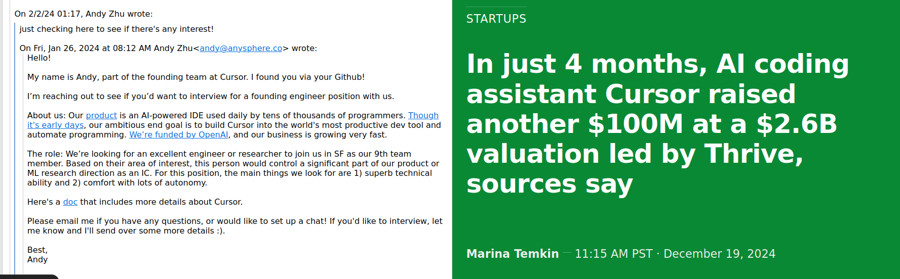

On several occasions, different people have asked me whether one shouldn’t push for certain actions because one might otherwise regret it later. I’ve never considered myself a regretful person. In fact, I think regret is a paralyzing emotion, and using the fear of future regret as a motivation for action feels flawed to me. I aim to take risks and live boldly. That approach naturally comes with the possibility of regret. Every closed door could lead to future regret. But while I resist letting potential regret dictate my actions, I still believe in making strategic, informed decisions based on the information available at the time.

That’s the ideal, anyway.

At the start of 2024, I was contacted by Cursor AI. You can see their current valuation here:

I can’t fully recall how it unfolded. I believe I might have replied and asked for an interview, but I’ve been unable to find any email confirming that, and honestly, I doubt that version of events. It’s more likely that I simply let the opportunity slip by.

Since then, I’ve asked myself: **What is regret actually good for?** What does psychology have to say about this?

### 1. Disclaimer: Take Psychological Insights with a Grain of Salt

Psychological findings have been proven wrong before (see the [replication crisis](https://en.wikipedia.org/wiki/Replication_crisis)). Moreover, many of the stu**dies discussed here involve small sample sizes. Still, I believe psychology offers valuable tools to understand the complex emotions and motivations that drive us.**

### 2. Regret Is Not as Devastating as I Thought

Regret is often considered one of the more constructive “negative” emotions ([source](https://pmc.ncbi.nlm.nih.gov/articles/PMC2413060/pdf/nihms-46512.pdf)). Among 12 negative emotions studied, regret was seen as the most beneficial across five psychological functions:

- Making sense of past experiences
- Facilitating approach behaviors
- Facilitating avoidance behaviors
- Gaining insights into the self
- Preserving social harmony

The study compared regret to other negative emotions such as:
- Anger
- Anxiety
- Boredom
- Disappointment
- Disgust
- Fear
- Frustration
- Guilt
- Jealousy
- Sadness
- Shame

Interestingly regret scores higher on the functions above than other, also action-focused emotions such as guilt and jealousy.

### 3. We Regret Inactions More Than Actions

According to [psychologists](https://doi.apa.org/doiLanding?doi=10.1037%2F0033-295X.94.3.319), three key domains shape how we perceive ourselves:

- Your “**actual self**” is who you are right now.
- Your “**ought self**” is who you believe you should be, based on obligations or responsibilities.
- Your “**ideal self**” is who you aspire to be or dream of becoming.

When regret arises, it often stems from a mismatch between these domains. Research suggests that in about **75% of cases**, people regret things they could have done but didn’t—just as in my case with Cursor AI.

### 4. Regret Can Be a Tool for Learning

While regret can linger and even haunt people for years, it also has the potential to be a powerful teacher. If we reflect on our actions (or inactions), regret can:

- **Clarify Values and Priorities:** Missed opportunities highlight what truly matters to us.
- **Reveal Barriers to Action:** Understanding what held us back can help us overcome those obstacles in the future.
- **Encourage Proactive Behavior:** The pain of regret can motivate us to seize future opportunities.

### What Do I Learn From This Personally?

Take chances while they’re there. Be more aggressive when I can afford to lose. Regret has taught me that while missed opportunities are painful, they can also be the catalyst for bold action moving forward. The important part is, when regret arises, to adopt strategies to deal with it (see “How to cope with regret: https://nesslabs.com/psychology-of-regret).